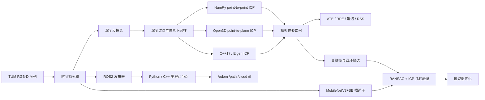

# RGB-D 里程计与点云配准

[](https://github.com/yang07-29/rgbd-pointcloud-registration/actions/workflows/tests.yml)
[](https://github.com/yang07-29/rgbd-pointcloud-registration/actions/workflows/linux-full-sequence.yml)
[](https://github.com/yang07-29/rgbd-pointcloud-registration/actions/workflows/ros2-cpp-full-sequence.yml)

这是我把专利中的 RGB-D 三维重建路线重新落到代码上的过程。

项目最初只有一个 NumPy/SciPy 版 ICP。为了弄清楚它在真实序列上到底能走多远，我补上了 TUM 数据关联、多帧位姿累积、ATE/RPE、Open3D 对照实验和逐帧性能记录；随后把核心链路迁移到 C++17，并接入 ROS2。现在仓库里既有便于理解算法的 Python 实现，也有可以在 Ubuntu 上构建和运行的 C++/ROS2 版本。

数据集使用 TUM RGB-D `freiburg1/xyz`。798 张 RGB 和深度图经过 20 ms 时间戳关联后得到 796 帧，下面的里程计结果都来自这组关联。

## 先看结果

在相同 796 帧、相同内参和相同 ATE/RPE 实现下：

| 方法 | ATE RMSE（m） | RPE 平移（m） | RPE 旋转（°） | 被拒绝的帧对 |
| --- | ---: | ---: | ---: | ---: |
| 相机保持静止 | 0.185814 | 0.011157 | 0.673521 | — |
| 自实现 point-to-point ICP | 0.152256 | 0.010426 | 0.559774 | 15 / 795 |
| Open3D point-to-plane ICP | **0.054045** | **0.005549** | **0.546981** | 0 / 795 |

这里有两个值得注意的地方：

- `fr1/xyz` 的运动幅度不大，所以“相机完全不动”也能得到 0.186 m 的 ATE。加入静止基线后，ICP 的提升才有参照。
- point-to-plane 的 ATE 比静止基线低约 70.9%，也明显优于自实现 point-to-point。代价是更高的内存占用，而且逐帧配准仍会积累漂移。

我随后在 129 个关键帧上加入回环和位姿图优化：

| 回环来源 | 优化前 ATE（m） | 优化后 ATE（m） | 变化 |
| --- | ---: | ---: | ---: |
| FPFH/RANSAC + ICP | 0.040787 | **0.023802** | -41.64% |
| MobileNetV3+SE 候选 + 几何验证 | 0.040787 | **0.024579** | -39.74% |

第二组实验使用的是关键帧轨迹，不能和上面的 796 帧 ATE 横向比较。学习描述子在 `fr1/desk` 训练、`fr1/desk2` 选阈值、`fr1/xyz` 测试，Recall@1/5 为 `0.9574 / 0.9787`。30 条候选边中有 2 条在事后检查时略超出预设的 5 cm 标准，这也是当前回环模块最需要改进的地方。

## 效果图

真实 RGB-D 反投影到点云：


位姿图优化前后的关键帧轨迹：


回环成功案例，以及被几何门限挡住的错误候选：


MobileNetV3+SE 的正确检索与高相似度误匹配：


ROS2 C++ 节点输出的 796 帧轨迹：


rosbag 回放时的 RViz，显示 `/path`、`/cloud` 和 TF：


## 系统怎么走



坐标系约定是 `T_w_c`，即相机坐标系到世界坐标系的变换。ICP 求出的相邻帧变换会按这个方向累积。真值位姿不进入配准，只在轨迹保存后计算指标。更完整的变换推导见 [`docs/ARCHITECTURE.md`](docs/ARCHITECTURE.md)。

## 性能记录

| 实现与平台 | 统计范围 | mean / p95（ms） | FPS | RSS 峰值 |
| --- | --- | ---: | ---: | ---: |
| NumPy point-to-point，Windows | 读图、预处理、ICP | 13.090 / 18.374 | 76.40 | 152.02 MiB |
| Open3D point-to-plane，Windows | 读图、预处理、ICP | 19.386 / 21.684 | 51.58 | 242.16 MiB |
| C++17 point-to-point，Windows | 读图、预处理、ICP | 11.395 / 16.801 | 87.76 | 33.72 MiB |
| C++17 point-to-point，Ubuntu CI | 读图、预处理、ICP | 12.218 / 18.964 | 81.84 | 71.12 MiB |
| ROS2 C++，Ubuntu CI | 单次回调计算 | 3.074 / 7.161 | 325.35* | 78.89 MiB |

`*` ROS2 数据按时间戳约 29.92 Hz 发布，325.35 FPS 是由回调计算时间换算出的吞吐，不是相机帧率。Windows 与 GitHub runner 也不是同一台机器，因此表里的跨平台耗时只适合看量级。

ROS2 C++ 的 [GitHub Actions 运行](https://github.com/yang07-29/rgbd-pointcloud-registration/actions/runs/30074936189) 处理了 796/796 帧，ATE 为 `0.175783 m`，RPE 为 `0.011151 m / 0.574568°`。逐帧 CSV、轨迹、节点日志和环境信息都保存在 [`results/ros2_cpp_linux_full/`](results/ros2_cpp_linux_full/)。

## 快速运行

### 1. 准备数据

从 [TUM RGB-D Dataset](https://cvg.cit.tum.de/data/datasets/rgbd-dataset/download) 下载 `freiburg1/xyz`，解压后放成下面的结构：

```text
data/rgbd_dataset_freiburg1_xyz/
  rgb.txt
  depth.txt
  groundtruth.txt
  rgb/*.png
  depth/*.png
```

原始数据不放在 Git 仓库中。学习回环实验还会用到同一页面的 `freiburg1/desk` 和 `freiburg1/desk2`。

### 2. Python 基线

```powershell
python -m venv .venv
.\.venv\Scripts\python.exe -m pip install -r requirements.lock.txt
.\.venv\Scripts\python.exe -m pytest -q

# 先用 20 帧检查环境
.\.venv\Scripts\python.exe -m src.run_odometry `
  --dataset data\rgbd_dataset_freiburg1_xyz `
  --output artifacts\tum_fr1_xyz_smoke `
  --max-frames 20

# 完整序列
.\.venv\Scripts\python.exe -m src.run_odometry `
  --dataset data\rgbd_dataset_freiburg1_xyz `
  --output artifacts\tum_fr1_xyz_full
```

### 3. Open3D 与参数实验

Open3D 0.19 在本项目的 Windows 环境中使用独立 Python 3.12 环境：

```powershell
conda create --prefix .conda-open3d python=3.12 pip --yes
.\.conda-open3d\python.exe -m pip install -r requirements-open3d.lock.txt
powershell -ExecutionPolicy Bypass -File scripts\run_parameter_sweep.ps1
```

脚本会运行 `voxel=0.03/0.05/0.08 m` 与 `correspondence=0.08/0.12/0.20 m` 的 3×3 网格，并分别测试 point-to-point 和 point-to-plane，共 18 组。

### 4. C++17 / CMake

Windows：

```powershell
powershell -ExecutionPolicy Bypass -File scripts\build_and_run_cpp.ps1
```

Ubuntu 安装 Eigen、OpenCV、CMake 和 Ninja 后：

```bash
./scripts/build_and_run_cpp.sh data/rgbd_dataset_freiburg1_xyz
```

### 5. 回环与位姿图

```powershell
powershell -ExecutionPolicy Bypass -File scripts\run_pose_graph.ps1
powershell -ExecutionPolicy Bypass -File scripts\run_loop_learning.ps1
powershell -ExecutionPolicy Bypass -File scripts\run_learned_pose_graph.ps1
```

### 6. ROS2

Windows RoboStack 的 Python 节点、rosbag 和 RViz 入口：

```powershell
conda env create --prefix .conda-ros2 --file configs\environment-ros2.yml
powershell -ExecutionPolicy Bypass -File scripts\build_ros2_windows.ps1
powershell -ExecutionPolicy Bypass -File scripts\run_ros2_tum_demo.ps1 `
  -Frames 796 -PublishHz 10 -TimeoutSeconds 180 `
  -OutputDirectory artifacts/ros2_full_fr1_xyz
.\.venv\Scripts\python.exe scripts\run_ros2_bag_roundtrip.py
.\.venv\Scripts\python.exe scripts\capture_ros2_rviz_demo.py
```

Ubuntu ROS2 C++ 的完整运行放在 GitHub Actions 的 `ROS2 C++ full TUM sequence` 工作流中。它会下载数据、Release 编译、回放 796 帧、评测轨迹并上传结果文件。

## 结果和代码在哪里

```text
src/                    Python 几何、评测、回环与训练代码
cpp/                    C++17 / Eigen / OpenCV 核心链路
ros2_ws/src/            ROS2 发布器和 Python/C++ 里程计节点
configs/                实验参数与环境文件
scripts/                构建、实验和演示入口
tests/                  几何、指标、数据关联与 ROS2 测试
results/                可以直接查看的小型结果与日志
docs/                   架构和展示图片
artifacts/              本地生成的大文件，不提交到 Git
```

几组主要结果：

- [`results/parameter_sweep/`](results/parameter_sweep/)：18 组 ICP 参数实验
- [`results/cpp_baseline/`](results/cpp_baseline/)：Python/C++ 对照
- [`results/pose_graph/`](results/pose_graph/)：关键帧、回环与位姿图
- [`results/loop_learning/`](results/loop_learning/)：MobileNetV3/SE 训练、消融和失败案例
- [`results/ros2/`](results/ros2/)：Windows ROS2、rosbag 与 RViz
- [`results/ros2_cpp_linux_full/`](results/ros2_cpp_linux_full/)：Ubuntu ROS2 C++ 796 帧运行

## 项目背景

这个项目来自我参与的公开专利申请《基于轻量级深度学习的 ROS 小车 3D 重建方法及系统》（`CN121095441A`，第二发明人）。专利给出了技术路线，这个仓库记录的是我后来逐项重建、运行和分析的部分。重点放在公开数据上的几何算法、C++ 工程和 ROS2 数据链路；硬件实验会在有对应设备和日志时单独整理。

目前仓库没有附加开源许可证。在导师、学校和共同发明人的知识产权要求确认前，公开可见不代表授权复制、修改或再分发。
