# RGB-D 点云配准：可复现 TUM 里程计基线

这是一个可检查、可复现的 RGB-D 几何里程计学习工程：包含自实现 NumPy/SciPy point-to-point ICP 与 Open3D point-to-plane ICP，并在本地 **TUM RGB-D `freiburg1/xyz`** 数据集上按同一协议真实评测。它是在重建公开专利技术路线中的几何基础，**不是**对专利中任何计划性能的验证。

当前里程计的 ICP 只使用深度图；RGB 图除时间戳关联外，还用于已经真实训练和评测的轻量回环描述子。离线关键帧、FPFH/RANSAC、学习候选和位姿图均已运行验证。ROS2 Jazzy Python 后端已经在 Windows RoboStack 环境完成 796 帧运行、rosbag2 录制/回放和 RViz 展示；ROS2 C++ 节点只有源码，本机因缺少 Visual Studio 2022 C++ 工具链而未运行。Jetson/机器人部署未做。

## 已实际运行的架构

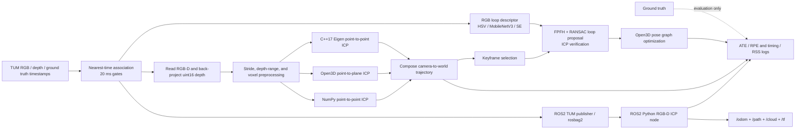

详细的数据流、坐标系与变换方向见 [`docs/ARCHITECTURE.md`](docs/ARCHITECTURE.md)。

## 已验证的真实结果

2026-07-24 在修正相邻帧变换累积方向后，重新执行完整 3×3 参数实验：

```powershell
powershell -ExecutionPolicy Bypass -File scripts\run_parameter_sweep.ps1
```

18 个原始实验的参数、环境与指标分别保存在 `artifacts/parameter_sweep/**/summary.json`；公开汇总见 [`results/parameter_sweep/README.md`](results/parameter_sweep/README.md) 与 [`benchmark_table.csv`](results/parameter_sweep/benchmark_table.csv)。798 组 RGB/深度图经过 20 ms 时间戳阈值关联后，得到 796 帧有效 RGB-D-真值对应关系，并评测全部 795 个相邻帧对。

| 方法与参数 | ATE RMSE（m） | RPE 平移 RMSE（m，Δ=1 帧） | RPE 旋转 RMSE（度，Δ=1 帧） | 拒绝/异常帧对 |
| --- | ---: | ---: | ---: | ---: |
| 静止 / 不估计运动基线 | 0.185814 | 0.011157 | 0.673521 | 不适用 |
| 自实现 point-to-point ICP（0.08 m / 0.12 m，自实现最低 ATE） | 0.152256 | 0.010426 | 0.559774 | 15 / 795 |
| Open3D point-to-plane ICP（0.05 m / 0.08 m，全表最低 ATE） | 0.054045 | 0.005549 | 0.546981 | 0 / 795 |

静止基线和 ICP 使用完全相同的 796 帧及相同评测代码。ICP 对每个相邻帧对都从单位相对位姿开始，估计过程绝不读取真值位姿；真值只在最后用于评测。ATE 对整条估计轨迹做一次刚体 SE(3) 对齐；RPE 在对齐前计算，因此代表局部相对位姿误差。

完整的 3×3 参数表（18 条真实结果）见 [`results/parameter_sweep/README.md`](results/parameter_sweep/README.md)。诚实结论：Open3D point-to-plane 在本次网格中同时取得最低 ATE 与显著更低的平移 RPE，但仍有累计漂移，且内存占用高于自实现版本；这是一条教学与工程基线，**不能**据此声称达到 SOTA 或完成完整 SLAM。轨迹图和原始日志保留在本地 `artifacts/`，避免将数据集衍生产物直接公开。

所有参数实验都在同一 Python 3.12/Open3D 环境、同一机器上顺序运行。最低 ATE 的 Open3D 行端到端均值为 **19.386 ms**、p95 为 **21.684 ms**、**51.58 FPS**、RSS 峰值 **242.16 MiB**；自实现最低 ATE 行（0.08/0.12）为 **13.090 ms**、p95 **18.374 ms**、**76.40 FPS**、RSS 峰值 **152.02 MiB**，但拒绝了 15/795 个帧对。经典 ICP 没有模型权重，也未使用 GPU，因此模型大小与显存为“不适用”。

同协议的 C++17/Eigen/OpenCV 全序列实现也已在本机真实运行。0.05/0.12 配置下，Python 与 C++ 都接受 786、拒绝 9 个帧对；C++ ATE RMSE 为 **0.175783 m**，端到端均值 **11.395 ms**、p95 **16.801 ms**、RSS 峰值 **33.72 MiB**。与 Python 的逐项公平对比见 [`results/cpp_baseline/README.md`](results/cpp_baseline/README.md)。这些是 Windows 实测，不冒充 Linux 实测。

关键帧/位姿图也已在同一序列真实运行：从 796 帧选择 129 个关键帧，30 个回环候选全部通过无真值几何门限，事后真值检查均正确；关键帧 ATE RMSE 从 **0.040787 m** 降到 **0.023802 m**，下降 **41.64%**。两个由估计轨迹远距离选出的错误 hard-negative 均被门限拒绝。完整协议、前后 RPE 与失败案例见 [`results/pose_graph/README.md`](results/pose_graph/README.md)。

轻量回环实验采用严格的跨序列划分：`fr1/desk` 训练、`fr1/desk2` 验证选阈值、`fr1/xyz` 最终测试。HSV、MobileNetV3 无 SE、MobileNetV3+SE 的测试 Recall@1 分别为 **0.9291 / 0.9574 / 0.9574**，Recall@5 为 **0.9433 / 0.9787 / 0.9787**；带 SE 模型测试 pair-F1 为 **0.6768**。冻结的带 SE 描述子接入相同几何验证和位姿图后，关键帧 ATE 从 **0.040787 m** 降到 **0.024579 m**，下降 **39.74%**。30 个边中事后真值标记 28 个正确、2 个略超 5 cm 正确门槛的错误边，作为真实失败保留。完整协议与结果见 [`results/loop_learning/README.md`](results/loop_learning/README.md)。

ROS2 Jazzy 的 Windows RoboStack 运行也复用了完全相同的 796 帧和 0.05/0.12 point-to-point 参数。Python ROS2 节点处理 **796/796** 帧，接受/拒绝 **786/9** 个相邻帧对；ATE RMSE 为 **0.175402 m**，RPE 平移/旋转 RMSE 为 **0.011151 m / 0.574628°**。回调均值/中位数/p95 为 **11.298 / 10.010 / 20.841 ms**，按回调均值换算 **88.51 FPS**，进程 RSS 峰值 **93.48 MiB**，最终待处理计数为 0。另录制了 RGB、depth、CameraInfo 各 60 条的 SQLite rosbag，停止实时发布后由新节点回放处理 60/60 帧，并在 RViz 中真实显示轨迹、点云和 TF。完整证据与平台边界见 [`results/ros2/README.md`](results/ros2/README.md)。

## 已完成的模块

- 读取 TUM 的 `rgb.txt`、`depth.txt`、`groundtruth.txt`；使用确定性的最近时间戳关联及明确阈值。
- 使用 TUM Kinect 内参和深度尺度 5000，把深度图反投影成相机坐标系点云。
- 每 8 个像素采样、0.2--4.0 m 深度过滤、5 cm 体素下采样、最近邻对应、Kabsch 刚体拟合与 point-to-point ICP。
- 多帧位姿累积、ATE/RPE、静止基线、TUM 格式轨迹文件、逐帧 CSV、端到端耗时/RSS 采样、轨迹图、JSON 实验记录与单元测试。
- C++17/CMake 版本：OpenCV 读取 RGB-D、Eigen SVD/Kabsch、精确 3D KD-tree、体素下采样、point-to-point ICP、位姿累积、ATE/RPE、CTest 与全序列性能记录。
- 关键帧、估计轨迹回环候选、FPFH/RANSAC 全局初值、point-to-plane ICP 验证、Open3D 位姿图优化、正确/错误候选后验分析与优化地图 PLY。
- 序列隔离的回环标签与检索协议、HSV 基线、MobileNetV3 无 SE/有 SE 消融、Triplet loss 训练、Recall@1/5 与 precision/recall、GPU 推理性能、学习候选接入几何验证和位姿图。
- ROS2 Jazzy TUM 模拟发布器、RGB/depth 近似同步、CameraInfo、Python ICP 节点、`/odom`/`/path`/`/cloud`/TF、逐帧性能与 TUM 轨迹、rosbag2 录制/回放和 RViz；Windows RoboStack 已运行验证，ROS2 C++ 节点仍只有源码。

## 可展示效果

真实 RGB、uint16 深度和反投影点云：

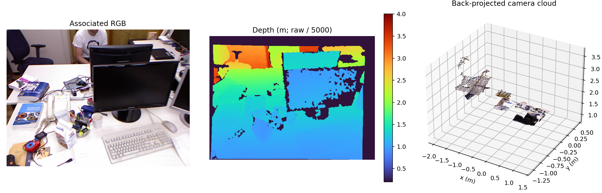

合成点云 ICP 前后对齐（仅证明算法正确，不是公开数据集性能）：

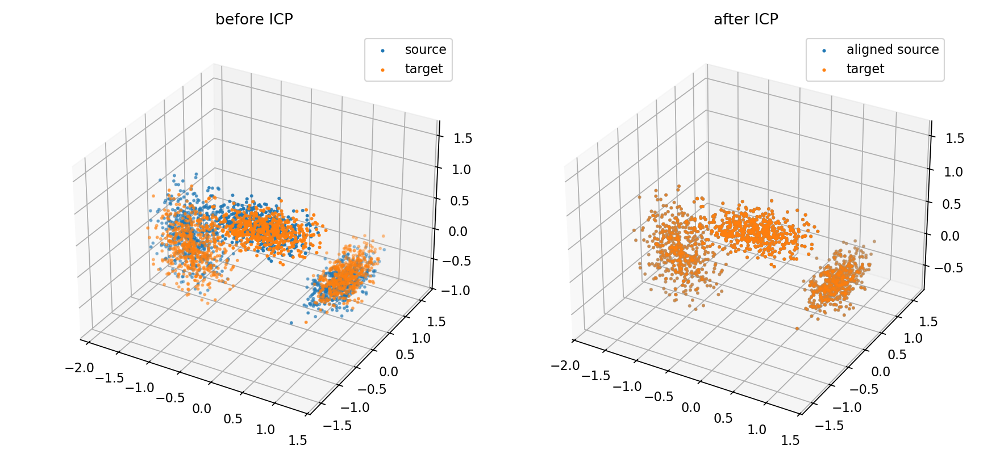

TUM `fr1/xyz` 位姿图优化前后：

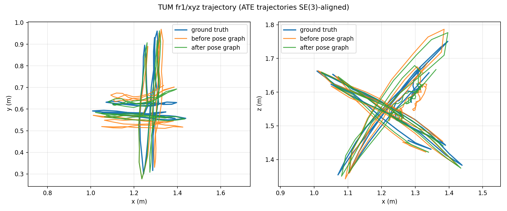

正确回环与被拒绝的错误候选：

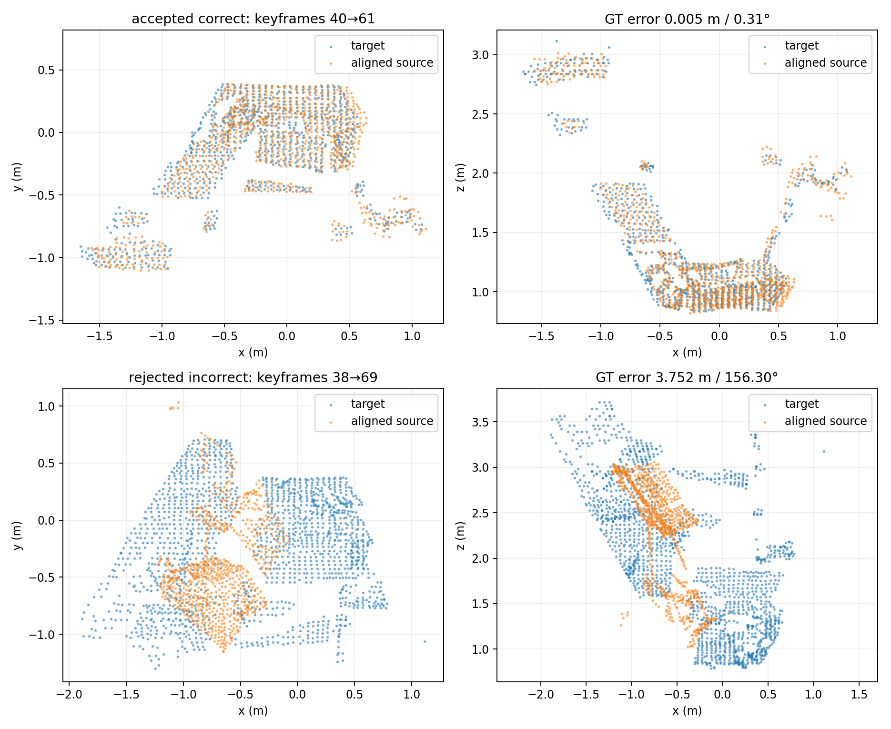

三种 RGB 回环描述子的统一测试结果：

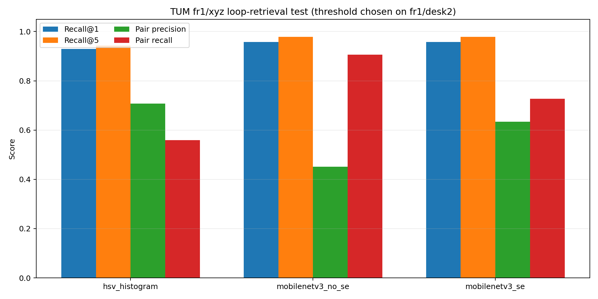

学习描述子的正确检索与高相似度误匹配：

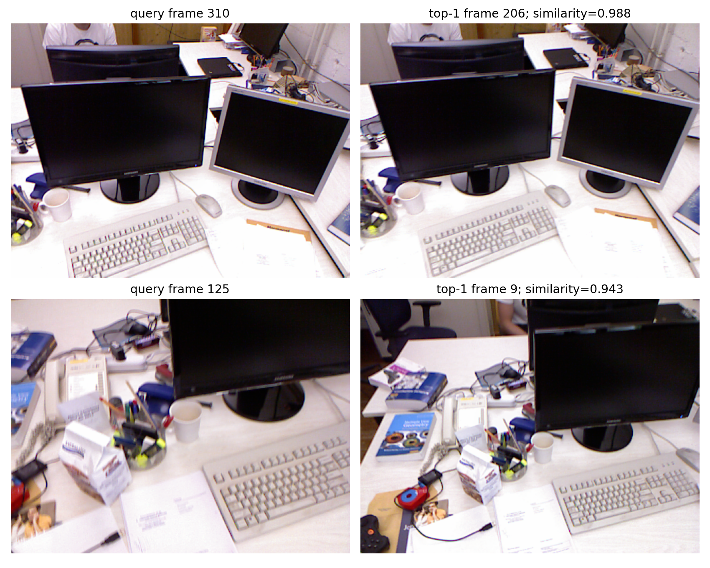

学习候选位姿图优化前后：

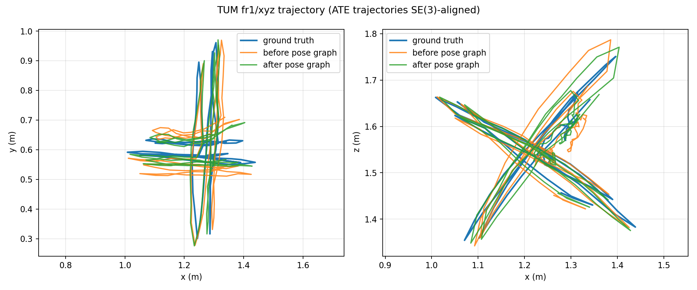

学习候选的正确边、被接受的边界失败和被拒绝错误案例：

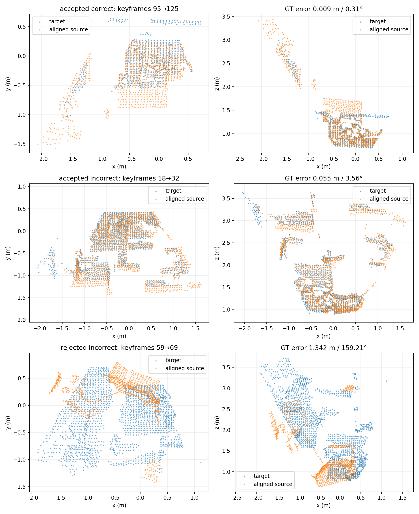

ROS2 全 796 帧轨迹（ATE 仅做 SE(3) 对齐，无缩放）：

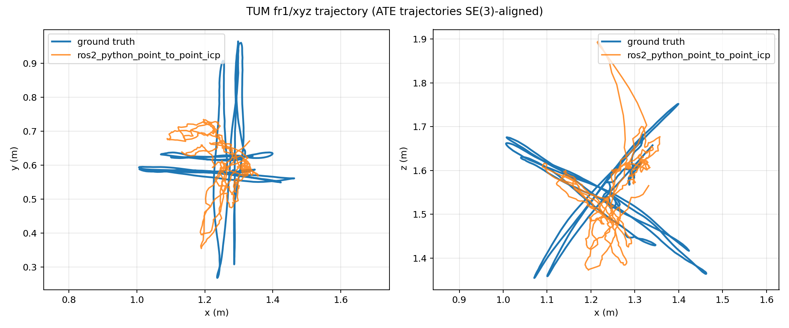

60 帧 rosbag 回放后的真实 RViz 窗口，显示 `/path`、`/cloud` 和 TF：

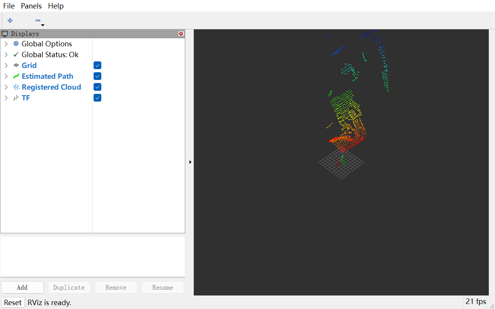

## 复现方法

数据集不会提交到仓库。解压 TUM 数据后目录应为：

请从 [TUM RGB-D Dataset 官方下载页](https://cvg.cit.tum.de/data/datasets/rgbd-dataset/download) 下载 `freiburg1/xyz`，并将压缩包解压到项目的 `data/` 目录。

复现学习实验还需要从同一官方页面下载 `freiburg1/desk` 和 `freiburg1/desk2`，分别用于训练和验证；三套原始数据都不会提交到 Git。

```text
data/rgbd_dataset_freiburg1_xyz/
  rgb.txt
  depth.txt
  groundtruth.txt
  rgb/*.png
  depth/*.png
```

要尽可能复现已验证结果，请用 Python 3.13 和锁定依赖版本：

```powershell
python -m venv .venv
.\.venv\Scripts\python.exe -m pip install -r requirements.lock.txt
.\.venv\Scripts\python.exe -m unittest discover -s tests -v
.\.venv\Scripts\python.exe -m src.run_odometry `
  --dataset data\rgbd_dataset_freiburg1_xyz `
  --output artifacts\tum_fr1_xyz_full
```

该实验没有随机过程，并会保存生效参数、时间戳、依赖版本、平台、汇总耗时、轨迹和每个 ICP 帧对记录。预期输出：

```text
artifacts/tum_fr1_xyz_full/
  summary.json                       # metrics, parameters, environment, timings
  icp_steps.csv                      # every pair's point counts, RMSE, iterations, time, failure state
  frame_timings.csv                  # each frame's input read/preprocess timing and RSS sample
  trajectory_icp_local.txt           # raw estimated camera-to-world trajectory
  trajectory_icp_ate_aligned.txt     # trajectory after the single ATE alignment
  trajectory_identity_ate_aligned.txt
  trajectory_xy_xz.png
```

`summary.json` 是唯一指标依据；不要把不同帧范围或参数的数字混入上方结果表。`artifacts/tum_fr1_xyz_smoke/` 只是开发用冒烟测试，不属于报告结果。

要检查一帧真实关联的 RGB-D 数据，并输出彩色 PLY 和预览图：

```powershell
.\.venv\Scripts\python.exe -m src.inspect_rgbd_frame `
  --dataset data\rgbd_dataset_freiburg1_xyz `
  --output artifacts\tum_fr1_xyz_frame_000 `
  --frame-index 0
```

## 常用运行命令

```powershell
# 前 20 个有效关联帧的快速检查
.\.venv\Scripts\python.exe -m src.run_odometry `
  --dataset data\rgbd_dataset_freiburg1_xyz `
  --output artifacts\tum_fr1_xyz_smoke `
  --max-frames 20

# 查看可调参数（采样间隔、体素大小、深度范围、对应点阈值等）
.\.venv\Scripts\python.exe -m src.run_odometry --help

# 合成点云算法演示（不是公开数据集性能）
.\.venv\Scripts\python.exe -m src.experiment --plot
```

改变任意参数时，请使用新的输出目录并视作新实验，避免静默覆盖已有证据。

### C++17 / CMake

Windows 的已验证构建与全序列运行入口：

```powershell
powershell -ExecutionPolicy Bypass -File scripts\build_and_run_cpp.ps1
```

Ubuntu 安装 `build-essential cmake ninja-build libeigen3-dev libopencv-dev` 后可运行：

```bash
./scripts/build_and_run_cpp.sh data/rgbd_dataset_freiburg1_xyz
```

GitHub Actions 会在 Ubuntu 上编译并运行 C++ 单元测试，并编译 ROS2 Jazzy C++ 节点。手动工作流 `.github/workflows/linux-full-sequence.yml` 会从 TUM 官方地址下载 `fr1/xyz`、运行全部 796 帧并上传仅含结果的 artifact；在该工作流真正成功前，README 不把 Linux 全序列写成已完成。

### 关键帧、回环与位姿图

```powershell
powershell -ExecutionPolicy Bypass -File scripts\run_pose_graph.ps1
```

该命令会重新运行完整 Open3D 里程计、选择关键帧、计算 FPFH、执行 RANSAC/ICP、优化位姿图，并写出轨迹、候选 CSV、位姿图 JSON、地图 PLY、图片和 `summary.json`。

### 轻量回环描述子

```powershell
conda create --prefix .conda-learning python=3.13 pip --yes
.\.conda-learning\python.exe -m pip install -r requirements-learning.lock.txt
powershell -ExecutionPolicy Bypass -File scripts\run_loop_learning.ps1
powershell -ExecutionPolicy Bypass -File scripts\run_learned_pose_graph.ps1
```

训练命令会生成 HSV、MobileNetV3 无 SE 和 MobileNetV3+SE 的统一结果，以及 checkpoint、描述子、检索图和完整 JSON/CSV。GPU 结果只对应 README 记录的 RTX 5060 Laptop GPU；其他设备应重新测量，不能照抄延迟。

### ROS2 Jazzy（Windows RoboStack）

本机验证环境采用独立 `.conda-ros2`，不会污染 Open3D 或训练环境：

```powershell
conda env create --prefix .conda-ros2 `
  --file configs\environment-ros2.yml

# 已验证的 Python ROS2 后端；加 -BuildCpp 需要 VS2022 C++ 工具链
powershell -ExecutionPolicy Bypass -File scripts\build_ros2_windows.ps1

# 796 帧实时话题链路、性能日志和轨迹
powershell -ExecutionPolicy Bypass -File scripts\run_ros2_tum_demo.ps1 `
  -Frames 796 -PublishHz 10 -TimeoutSeconds 180 `
  -OutputDirectory artifacts/ros2_full_fr1_xyz

# 60 帧 rosbag2 录制 -> 停止实时发布 -> 新节点回放
.\.venv\Scripts\python.exe scripts\run_ros2_bag_roundtrip.py

# 打开真实 RViz、回放 bag 并捕获窗口证据
.\.venv\Scripts\python.exe scripts\capture_ros2_rviz_demo.py
```

Windows 运行器显式隔离 PATH，以避免用户全局 Anaconda DLL 与 RoboStack 冲突，并加入 `rviz_ogre_vendor` 路径。rosbag 在该 Windows 发行包上使用 ROS2 官方 `reindex` 完成元数据恢复；脚本随后强制核对三个话题的准确消息数。详见 [`results/ros2/README.md`](results/ros2/README.md)。

## 指标含义

记 `T_w_c(i)` 为第 `i` 帧相机坐标系到世界坐标系的位姿。

- **ATE**：将所有估计位置与所有真值位置做一次最小二乘刚体对齐后，统计位置误差；报告单位为米的 RMSE。
- **RPE**：对每个相邻帧对比较 `inv(T(i)) @ T(i+1)` 的估计与真值；报告平移 RMSE（米）和旋转 RMSE（度）。
- **静止基线**：把每一步相对运动都设为单位变换。它是必要参照，因为短序列即使完全不估计运动，ATE 也可能看似不错。

## 当前局限与下一步工程

Point-to-point 和当前 point-to-plane ICP 都对深度噪声、动态像素、重复几何和累计漂移敏感。学习描述子只在三个 TUM 室内序列上训练/验证/测试，不足以证明跨数据集泛化；其几何门限还接受了两个略超预定 5 cm 正确标准的边。ROS2 当前只在 Windows RoboStack 上验证 Python 后端；Ubuntu 下的 ROS2 C++ 节点编译/运行、更多公开序列、实机传感器、Jetson 和机器人仍未验证。

不要将当前结果表述为整项专利验证、ROS2 C++ 实时性能、机器人/Jetson 部署、跨数据集泛化或 SOTA 基准。[`EVIDENCE_LOG.md`](EVIDENCE_LOG.md) 明确记录了这个边界。

## 责任、专利与公开边界

本仓库重建的是公开专利申请《基于轻量级深度学习的 ROS 小车 3D 重建方法及系统》（`CN121095441A`，项目作者为第二发明人）中的部分技术路线。当前只对仓库内真实运行的几何、轻量回环及限定平台下的 ROS2 Python 实验负责；不声称整项专利、ROS2 C++ 实时链路、Jetson 或机器人部署已验证。

项目作者可诚实负责并解释：数据关联与评测协议、RGB-D 反投影/预处理、NumPy/SciPy Kabsch/ICP、Open3D point-to-plane 基线、C++17/Eigen/OpenCV/CMake 热路径、关键帧/FPFH/RANSAC/位姿图、MobileNetV3/SE 回环描述子及消融、ROS2 话题/同步/TF/rosbag/RViz、ATE/RPE、实验记录和文档。仓库不包含 TUM 原始数据、专利原文或未公开材料。

仓库可以公开查看，但在导师、实验室、学校和共同发明人的知识产权要求确认前，**不附加开源许可证**；ROS2 包元数据暂标为 `Proprietary`。公开可见不等于授权他人复制、修改或再分发。确认权属后，再根据书面结论选择合适许可证。

## 后续路线

1. 已完成 Python/Open3D 公平基线、3×3 参数表、C++17/CMake 核心热路径、关键帧/传统回环/位姿图、序列隔离的 MobileNetV3/SE 回环实验，以及 Windows RoboStack ROS2 Python/rosbag/RViz 链路。
2. 下一步在 Ubuntu 24.04/WSL 或 CI 中编译并运行 ROS2 C++ 节点，用相同 796 帧协议与 Python ROS2 后端比较。
3. 随后补充更多公开序列和负例，改善学习回环的几何门限与泛化评测。
4. 没有真实 Jetson/机器人硬件时，不声称硬件部署结果。

### Open3D 隔离环境

当前主 `.venv` 为 Python 3.13，而 Open3D 0.19 的 Windows wheel 仅提供到 Python 3.12，因此 Open3D 比较使用项目内独立的 `.conda-open3d` 环境。创建和安装命令如下；它不会替换已验证主环境：

```powershell
conda create --prefix .conda-open3d python=3.12 pip --yes
.\.conda-open3d\python.exe -m pip install -r requirements-open3d.lock.txt
.\.conda-open3d\python.exe -m src.open3d_odometry `
  --dataset data\rgbd_dataset_freiburg1_xyz `
  --output artifacts\tum_fr1_xyz_open3d_point_to_plane

# 完整 3×3 参数实验与统一 CSV/Markdown 表
powershell -ExecutionPolicy Bypass -File scripts\run_parameter_sweep.ps1
```
