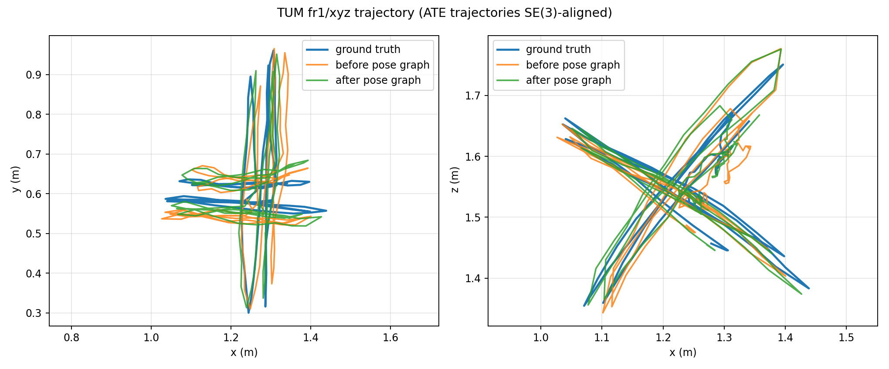
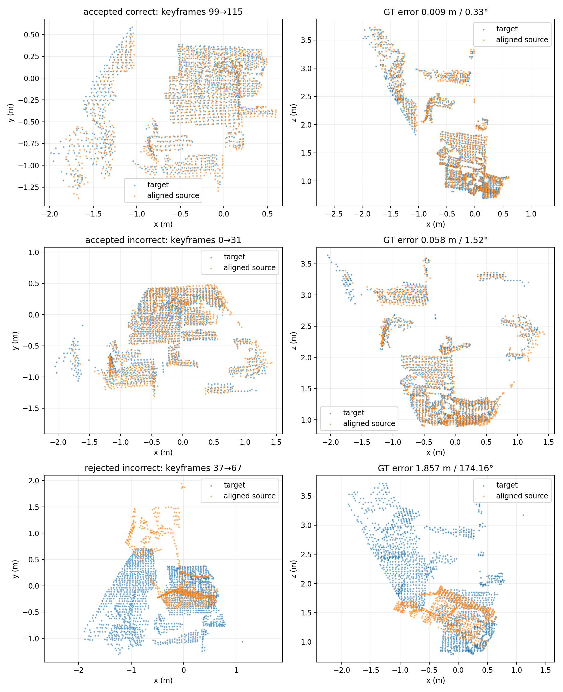
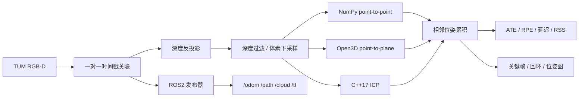

# RGB-D 里程计与点云配准

[](https://github.com/yang07-29/RGB-D/actions/workflows/tests.yml)
[](https://github.com/yang07-29/RGB-D/actions/workflows/linux-full-sequence.yml)
[](https://github.com/yang07-29/RGB-D/actions/workflows/ros2-cpp-full-sequence.yml)

这是我用公开数据重新验证 RGB-D 三维重建基本链路的工程记录。输入是彩色图、深度图和相机内参，程序完成时间戳关联、深度反投影、点云预处理、相邻帧 ICP、位姿累积，并在轨迹生成后计算 ATE、RPE、延迟和内存。

仓库保留了三条实现：便于读懂算法的 NumPy/SciPy point-to-point ICP、作为成熟库对照的 Open3D point-to-plane ICP，以及 C++17/Eigen/OpenCV 版本。实验使用 TUM RGB-D 数据，真值位姿只参与最后评测，不参与 ICP 初始化。

## 目前跑出的结果

### fr1/xyz 参数实验

798 张 RGB 与 798 张深度图在 20 ms 门限内做一对一时间戳关联，再与真值一对一关联，得到 790 组独立 RGB-D 帧。这里的“一对一”很重要：同一张深度图不会被多个 RGB 帧重复使用。

下表中的 NumPy 和 Open3D 行分别取 18 组网格实验中 ATE 最低的配置。ATE 使用 SE(3) 对齐，不允许缩放；RPE 同时给出短间隔 Δ=1 和较长间隔 Δ=30 帧。

| 方法 | voxel / correspondence（m） | ATE（m） | RPE Δ1（m / °） | RPE Δ30（m / °） | mean / p95（ms） | FPS | RSS | 拒绝帧对 |
| --- | --- | ---: | ---: | ---: | ---: | ---: | ---: | ---: |
| 相机保持静止 | N/A | 0.186227 | 0.011286 / 0.679 | 0.274607 / 10.627 | N/A | N/A | N/A | N/A |
| NumPy point-to-point | 0.08 / 0.12 | 0.152786 | 0.010438 / 0.562 | 0.212216 / 5.507 | 12.61 / 16.83 | 79.28 | 138.4 MiB | 15 / 789 |
| Open3D point-to-plane | 0.05 / 0.08 | **0.058947** | **0.005687 / 0.551** | **0.046375 / 2.705** | 26.76 / 30.01 | 37.36 | 228.8 MiB | 22 / 789 |

完整 18 行结果、参数和原始 summary 路径见 [`results/parameter_sweep_one_to_one_quality_v2/`](results/parameter_sweep_one_to_one_quality_v2/)。失败判据不是“程序是否报错”，而是最终变换下的对应点比例和全源点最近邻 RMSE；被拒绝的帧对保持上一有效位姿，并照常计入轨迹误差。

### 固定参数迁移到三条序列

我把配置固定为 `voxel=0.05 m`、`correspondence=0.08 m`，然后直接运行 fr1/desk 和 fr1/desk2，不再根据这两条序列挑参数。

| 序列 | 独立关联帧 | 静止基线 ATE | NumPy ATE | Open3D ATE | Open3D 拒绝帧对 |
| --- | ---: | ---: | ---: | ---: | ---: |
| fr1/xyz | 790 | 0.186227 | 0.180483 | **0.058947** | 22 / 789 |
| fr1/desk | 573 | 0.871404 | 0.428433 | **0.225788** | 6 / 572 |
| fr1/desk2 | 612 | 0.970802 | 0.551096 | **0.391915** | 18 / 611 |

完整的 Δ=1/30 RPE、延迟、FPS 和 RSS 在 [`results/multi_sequence_one_to_one_quality_v2/`](results/multi_sequence_one_to_one_quality_v2/)。desk2 的 ATE 仍有 0.392 m，说明逐帧 ICP 在快速运动和低重叠情况下会累积明显漂移；这也是后续跟踪恢复和回环模块要解决的问题。

### Python 与 C++ 对照

同为 `voxel=0.05 m`、`correspondence=0.12 m` 时，Python 与 C++ 使用相同的 790 帧关联、失败门限和 SE(3) 评测：

| 实现 | ATE（m） | RPE Δ1（m / °） | 接受 / 拒绝 | mean / p95（ms） | RSS |
| --- | ---: | ---: | ---: | ---: | ---: |
| Python / NumPy | 0.175732 | 0.011160 / 0.575283 | 780 / 9 | 17.48 / 31.39 | 146.8 MiB |
| C++17 / Eigen / OpenCV | 0.175657 | 0.011160 / 0.575273 | 780 / 9 | 13.96 / 21.65 | 33.5 MiB |

C++ 的逐帧 CSV、未对齐轨迹和 summary 见 [`results/cpp_one_to_one_quality_v2/`](results/cpp_one_to_one_quality_v2/)。两种实现的 ATE 相差约 0.075 mm，给数据关联、位姿累积和指标实现提供了跨语言核对。性能来自同一台 Windows 主机的单次运行，只用于记录本次实验，不表示硬件无关的速度。

### 独立指标核对

我用 evo 1.37.1 重新读取保存的 Open3D 轨迹。ATE 只做 SE(3) Umeyama 对齐，没有 scale correction；Δ=30 RPE 使用全部 760 个重叠帧对。ATE、Δ=1/30 平移 RPE 和旋转 RPE 五项与项目实现的最大绝对差为 `1.065e-09`。机器可读差值和五个 evo 原始结果包见 [`results/evo_crosscheck_one_to_one_v2/`](results/evo_crosscheck_one_to_one_v2/)。

### 跟踪丢失与恢复

连续 2 个帧对被拒绝时记为一次 LOST。可选的 `predictive_recovery` 模式会在单位初值失败后尝试恒速初值、粗到细 ICP、最近有效关键帧和内部暂定位姿链。为了模拟更快运动和更低重叠，我分别每次跳过 0、1、2 帧运行完整序列。

| frame step | 基线 ATE（m） | 恢复模式 ATE（m） | 恢复尝试成功 | 恢复模式 mean / p95（ms） |
| ---: | ---: | ---: | ---: | ---: |
| 1 | 0.180483 | 0.180483 | 0 / 0 | 28.45 / 55.16 |
| 2 | 0.107069 | 0.108748 | 3 / 6 | 39.89 / 78.24 |
| 3 | 0.239388 | **0.196357** | 5 / 13 | 46.92 / 91.78 |

恢复模式在正常输入上保持相同轨迹但增加延迟；step=2 略差；step=3 的 ATE 下降约 18%，但短间隔 RPE 从 `0.024050 m / 1.223°` 变差到 `0.028843 m / 1.471°`。因此它作为实验选项保留，没有替换默认基线。六次原始 summary 和完整表格见 [`results/tracking_stress_one_to_one_v2/`](results/tracking_stress_one_to_one_v2/)。

### 位姿图与错误回环压力测试

在同一组 790 帧上选出 125 个关键帧。顺序关键帧 ICP 和回环边统一检查最终变换下的对应比例、残差和里程计一致性；不通过的顺序边改用已经生成的前端里程计变换，避免把低质量 ICP 当成确定边。

| 关键帧轨迹 | ATE（m） | RPE Δ1（m / °） | RPE Δ30（m / °） |
| --- | ---: | ---: | ---: |
| 优化前 | 0.044338 | 0.014733 / 1.246 | 0.066234 / 2.888 |
| 正常位姿图优化后 | **0.029692** | **0.014641 / 1.236** | **0.043144 / 2.568** |
| 强制插入一条错误边 | 0.464398 | 0.038497 / 1.710 | 0.546136 / 19.348 |

正常优化使关键帧 ATE 下降约 33%。作为对照，我从困难负例中选出一条事后真值误差为 `1.360 m / 133.7°` 的错误边，绕过生产门限强制加入图中，ATE 随即扩大到 46.4 cm。这个压力实验只用于说明错误回环的破坏性；真值没有参与正常候选生成或接收。

30 个正常候选中有 22 个正确接收、1 个错误接收和 7 个正确候选被拒绝；另选的 10 个困难负例全部被拒绝。说明当前门限有效但偏保守，而且仍未彻底消除误接收。逐边 CSV、优化前后轨迹、错误边轨迹和完整参数见 [`results/pose_graph_one_to_one_edge_quality_v2/`](results/pose_graph_one_to_one_edge_quality_v2/)。

## 效果图

真实深度图反投影后的点云：


关键帧轨迹在位姿图优化前后的对照：



回环候选的正确案例与被几何门限拒绝的错误案例：



ROS2 rosbag 回放时在 RViz 中显示的 `/path`、`/cloud` 和 TF：


位姿图图片来自上面的 790 帧一对一实验。ROS2 图片仍来自仓库早期的 796 帧“允许最近深度复用”协议，只用于展示节点和 RViz 的运行形态，不与主结果混合比较。

## 数据流和坐标系



轨迹统一使用 `T_w_c`：把相机坐标中的点变换到世界坐标。ICP 求 `T_prev_curr`，把当前帧点变换到上一帧，因此按 `T_w_curr = T_w_prev @ T_prev_curr` 累积。推导和 ROS2 坐标关系见 [`docs/ARCHITECTURE.md`](docs/ARCHITECTURE.md)。

## 在 Windows 上复现

### 1. 准备数据

从 [TUM RGB-D Dataset](https://cvg.cit.tum.de/data/datasets/rgbd-dataset/download) 下载 `freiburg1/xyz`、`freiburg1/desk` 和 `freiburg1/desk2`，解压为：

```text
data/
  rgbd_dataset_freiburg1_xyz/
    rgb.txt
    depth.txt
    groundtruth.txt
    rgb/*.png
    depth/*.png
  rgbd_dataset_freiburg1_desk/
  rgbd_dataset_freiburg1_desk2/
```

数据集不提交到 Git。

### 2. Python 与 Open3D

本次正式实验使用 Python 3.12 和 Open3D 0.19：

```powershell
conda create --prefix .conda-open3d python=3.12 pip --yes
.\.conda-open3d\python.exe -m pip install -r requirements-open3d-dev.lock.txt
.\.conda-open3d\python.exe -m pytest tests -q

# 20 帧冒烟测试
.\.conda-open3d\python.exe -m src.run_odometry `
  --dataset data\rgbd_dataset_freiburg1_xyz `
  --output artifacts\smoke_numpy --max-frames 20

.\.conda-open3d\python.exe -m src.open3d_odometry `
  --dataset data\rgbd_dataset_freiburg1_xyz `
  --output artifacts\smoke_open3d --max-frames 20

# 18 组参数实验与三序列固定配置实验
powershell -ExecutionPolicy Bypass -File scripts\run_parameter_sweep.ps1
powershell -ExecutionPolicy Bypass -File scripts\run_multi_sequence_benchmark.ps1

# 独立核对保存轨迹的 ATE/RPE
.\.conda-open3d\python.exe -m pip install -r requirements-evaluation.lock.txt
powershell -ExecutionPolicy Bypass -File scripts\run_evo_crosscheck.ps1

# 跟踪丢失与跳帧压力实验
powershell -ExecutionPolicy Bypass -File scripts\run_tracking_stress.ps1

# 位姿图、回环质量门与错误边压力实验
powershell -ExecutionPolicy Bypass -File scripts\run_pose_graph.ps1
```

真值文件不是里程计的必需输入。对没有 `groundtruth.txt` 的 RGB-D 目录，或者希望显式关闭评测时：

```powershell
.\.conda-open3d\python.exe -m src.run_odometry `
  --dataset data\my_rgbd_sequence `
  --output artifacts\my_trajectory `
  --no-evaluation
```

### 3. C++17 / CMake

Windows 需要 CMake、Ninja、Eigen、OpenCV 和支持 C++17 的编译器。脚本会先找 `PATH`，也可显式指定 MSYS2 MinGW 根目录：

```powershell
powershell -ExecutionPolicy Bypass -File scripts\build_and_run_cpp.ps1 `
  -Dataset data\rgbd_dataset_freiburg1_xyz `
  -Output artifacts\cpp_full `
```

Ubuntu 安装 Eigen、OpenCV、CMake 和 Ninja 后：

```bash
bash scripts/build_and_run_cpp.sh \
  data/rgbd_dataset_freiburg1_xyz \
  artifacts/linux_cpp_full
```

### 4. 学习描述子与 ROS2

这些入口保留用于继续实验，结果版本说明分别写在各自结果目录中：

```powershell
powershell -ExecutionPolicy Bypass -File scripts\run_loop_learning.ps1
powershell -ExecutionPolicy Bypass -File scripts\run_learned_pose_graph.ps1
```

ROS2 发布器、Python/C++ 节点、rosbag 和 RViz 的结构见 [`ros2_ws/src/rgbd_odometry_ros/`](ros2_ws/src/rgbd_odometry_ros/)；Ubuntu C++ 全序列入口是 [`scripts/run_ros2_cpp_full_sequence.sh`](scripts/run_ros2_cpp_full_sequence.sh)。

## 目录

```text
src/          Python 几何、里程计、评测、回环与训练代码
cpp/          C++17 / Eigen / OpenCV 核心链路
ros2_ws/      ROS2 发布器与里程计节点
configs/      实验和环境配置
scripts/      构建、批量实验与演示入口
tests/        几何、指标、数据关联与 ROS2 测试
results/      提交到 Git 的表格、轨迹和小型日志
docs/         架构说明和展示图片
artifacts/    本地生成的大文件，已由 .gitignore 排除
```

## 项目来源与结果边界

项目源于我参与的公开专利申请《基于轻量级深度学习的 ROS 小车 3D 重建方法及系统》（CN121095441A，第二发明人）。专利给出技术路线，这个仓库记录我后来在公开数据上重新实现、运行和核对的工程结果。

主页只把有代码、命令和结果文件对应的内容写成实验结论。Jetson 和真实小车数据不在当前结果中；如果后续完成硬件运行，会另附设备型号、软件版本、日志和视频。公开代码前仍需确认导师、学校及相关知识产权归属。
