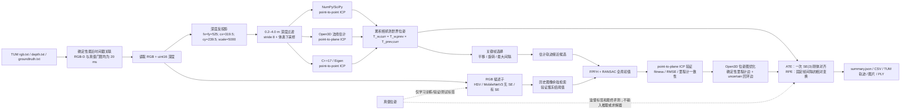
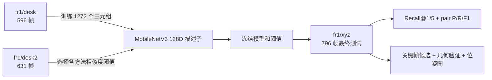

# 已运行与待运行的工程架构

## 离线 RGB-D 里程计与 SLAM 实验



三种 ICP 实现使用相同的 796 帧关联、相同点云输入、单位相对位姿初值和同一套 ATE/RPE 定义。ICP 返回的 `T_prev,curr` 把当前相机坐标中的点变换到上一帧坐标，因此直接右乘到上一帧相机到世界位姿：

```text
p_prev = T_prev,curr @ p_curr
p_world = T_w,prev @ p_prev
T_w,curr = T_w,prev @ T_prev,curr
```

不能对 `T_prev,curr` 再取逆。这个方向由合成变换测试和 Python/C++ 全序列交叉结果共同验证。

传统位姿候选读取估计轨迹；学习候选函数只接收冻结的 RGB 描述子，不接收估计位姿或真值。两条候选支路之后共享 FPFH/RANSAC、ICP 与几何门限。真值只在全部配准结束后计算 ATE/RPE 和事后 correct/incorrect 标签，绝不决定边是否加入位姿图。

## 学习实验的数据边界



测试序列不会参与 checkpoint 或阈值选择。Recall@K 只统计存在至少一个真值历史回环的查询；pair precision/recall 统计全部满足时间间隔的查询—候选对。

## ROS2 数据链路：Windows RoboStack 已运行

`ros2_ws/src/rgbd_odometry_ros` 包含 TUM 模拟发布器、RGB/depth 近似同步、CameraInfo、C++ 节点源码与可移植 Python ICP 后端；`rgbd_odometry_py` 提供 Windows 可执行入口。2026-07-24 已在隔离的 RoboStack Jazzy + CycloneDDS 环境完成 796 帧直接话题运行、60 帧 rosbag2 录制/独立回放和真实 RViz 显示。因为本机缺少 Visual Studio 2022 C++ 工具链，实际运行的是 Python 后端，不能把这些数字写成 ROS2 C++ 性能。


TUM 发布器只输出图像和内参；groundtruth pose 不进入 ROS graph。为与离线协议逐项公平，回放工具用 groundtruth **时间戳**筛出同一组 796 帧，但不解析或发布真值位姿。里程计节点从单位相对初值独立估计运动，结束后才用保存轨迹计算 SE(3) ATE 与 Δ=1 RPE。

完整运行处理 796/796 帧、最终待处理计数为 0，接受/拒绝 786/9 个帧对；回调均值/中位数/p95 为 11.298/10.010/20.841 ms。60 帧 rosbag 含三个输入话题各 60 条，新节点回放后重新产生 60 行轨迹。RViz 配置把点云 Reliability 明确设为 Best Effort，与节点 sensor-data QoS 一致；真实截图和日志见 `results/ros2/`。

GitHub Actions 运行 [30070818522](https://github.com/yang07-29/rgbd-pointcloud-registration/actions/runs/30070818522) 已在 Ubuntu 24.04 编译并测试 ROS2 C++ 节点；运行 [30070922101](https://github.com/yang07-29/rgbd-pointcloud-registration/actions/runs/30070922101) 已让独立 C++17 核心处理同一 796 帧全序列。仍未完成的是让 ROS2 C++ 节点在 ROS graph 中消费完整序列并记录话题级性能，这三条证据不能混为一条。
