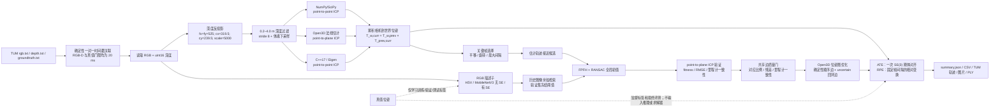
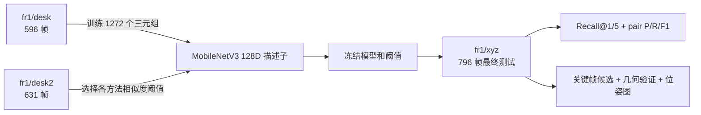
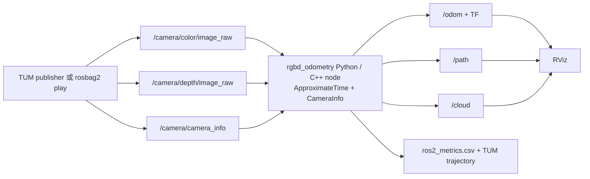

# 工程架构与实验协议

离线里程计和位姿图主结果自 2026-09-14 起采用不复用 RGB、depth 或 groundtruth 样本的一对一关联，fr1/xyz 共 790 帧。下文单独标为“历史运行”的 796 帧学习和 ROS2 结果使用早期最近邻复用协议，不与 790 帧主结果比较。

## 离线 RGB-D 里程计与 SLAM 实验



三种 ICP 实现使用相同的 790 帧一对一关联、相同点云输入、单位相对位姿初值和同一套 ATE/RPE 定义。ICP 返回的 `T_prev,curr` 把当前相机坐标中的点变换到上一帧坐标，因此直接右乘到上一帧相机到世界位姿：

```text
p_prev = T_prev,curr @ p_curr
p_world = T_w,prev @ p_prev
T_w,curr = T_w,prev @ T_prev,curr
```

不能对 `T_prev,curr` 再取逆。这个方向由合成变换测试和 Python/C++ 全序列交叉结果共同验证。

离线 NumPy 和 Open3D 默认按帧执行“读图 → 当前点云 → 与上一点云配准 → 丢弃更早点云”，不再预先缓存完整序列。性能协议把 RGB-D 解码、预处理、配准/质量判定、计算延迟和输入到位姿延迟分开；RSS 在每帧计时结束后采样。正式数字排除前 30 个预热帧，但这些帧仍进入轨迹。结果写盘、绘图、真值评测和时间戳关联不计入逐帧输入到位姿延迟。

RGB-D 配对不依赖 groundtruth。数据目录没有真值或命令使用 `--no-evaluation` 时，NumPy/Open3D 仍生成未对齐 TUM 轨迹和逐帧性能文件；只有 ATE/RPE、静止基线和对齐图被省略。正式 790 帧 Open3D 轨迹另由 evo 1.37.1 独立复核，五项 RMSE 最大绝对差为 `1.065e-09`。

默认里程计仍使用单位相对初值。可选 `predictive_recovery` 前端把连续 2 个拒绝定义为 LOST，并保存“有效输出位姿”和“内部暂定位姿”两条状态：失败帧的公开轨迹冻结，内部链用于下一帧重新接回；同时可尝试恒速初值、粗到细 ICP 和最近有效关键帧。该策略只在 frame step=3 压力实验中降低 ATE，正常序列没有精度收益，因此没有替换默认路径。

传统位姿候选读取估计轨迹；学习候选函数只接收冻结的 RGB 描述子，不接收估计位姿或真值。两条候选支路之后共享 FPFH/RANSAC、ICP 与几何门限。真值只在全部配准结束后计算 ATE/RPE 和事后 correct/incorrect 标签，绝不决定边是否加入位姿图。

新版位姿图还把共享最终变换质量用于相邻关键帧边。低质量关键帧 ICP 不会作为确定边写入，而是退回已经独立生成的全帧里程计相对变换以保持图连通。790 帧实验的 124 条顺序边中 40 条触发该退回；正常图优化把 125 个相同关键帧上的 ATE 从 `0.044338 m` 降至 `0.029692 m`。另有一条明确绕过门限的错误边压力测试把 ATE 恶化到 `0.464398 m`，不属于生产推理流程。

## 学习实验的数据边界（历史 796 帧协议）



测试序列不会参与 checkpoint 或阈值选择。Recall@K 只统计存在至少一个真值历史回环的查询；pair precision/recall 统计全部满足时间间隔的查询—候选对。

## ROS2 数据链路（历史 796 帧运行）

`ros2_ws/src/rgbd_odometry_ros` 包含 TUM 模拟发布器、RGB/depth 近似同步、CameraInfo、C++ 节点源码与可移植 Python ICP 后端；`rgbd_odometry_py` 提供 Windows 可执行入口。2026-07-24 已在隔离的 RoboStack Jazzy + CycloneDDS 环境完成 Python 后端 796 帧直接话题运行、60 帧 rosbag2 录制/独立回放和真实 RViz 显示。因为本机缺少 Visual Studio 2022 C++ 工具链，这些 Windows 数字不能写成 C++ 性能；C++ 证据来自下述 Ubuntu 工作流。



TUM 发布器只输出图像和内参；groundtruth pose 不进入 ROS graph。为与离线协议逐项公平，回放工具用 groundtruth **时间戳**筛出同一组 796 帧，但不解析或发布真值位姿。里程计节点从单位相对初值独立估计运动，结束后才用保存轨迹计算 SE(3) ATE 与 Δ=1 RPE。

完整运行处理 796/796 帧、最终待处理计数为 0，接受/拒绝 786/9 个帧对；回调均值/中位数/p95 为 11.298/10.010/20.841 ms。该历史 `callback_latency_ms` 从同步回调入口计到 ROS 输出发布和轨迹流写入完成，不包含随后执行的 RSS 查询、指标 CSV 序列化/flush 和周期日志，不能当作这些操作也在内的总延迟。60 帧 rosbag 含三个输入话题各 60 条，新节点回放后重新产生 60 行轨迹。RViz 配置把点云 Reliability 明确设为 Best Effort，与节点 sensor-data QoS 一致；真实截图和日志见 `results/ros2/`。

GitHub Actions 运行 [30070818522](https://github.com/yang07-29/RGB-D/actions/runs/30070818522) 在 Ubuntu 24.04 编译并测试 ROS2 C++ 节点；运行 [30070922101](https://github.com/yang07-29/RGB-D/actions/runs/30070922101) 让独立 C++17 核心处理同一 796 帧；运行 [30074936189](https://github.com/yang07-29/RGB-D/actions/runs/30074936189) 进一步让 ROS2 C++ 节点通过真实 topic graph 处理 796/796 帧并记录 ATE/RPE、回调延迟、RSS、话题和日志。三组证据的性能范围不同，不能混成一个端到端数字；新的工作流默认帧数已经改为 790，推送后将生成新版证据。
