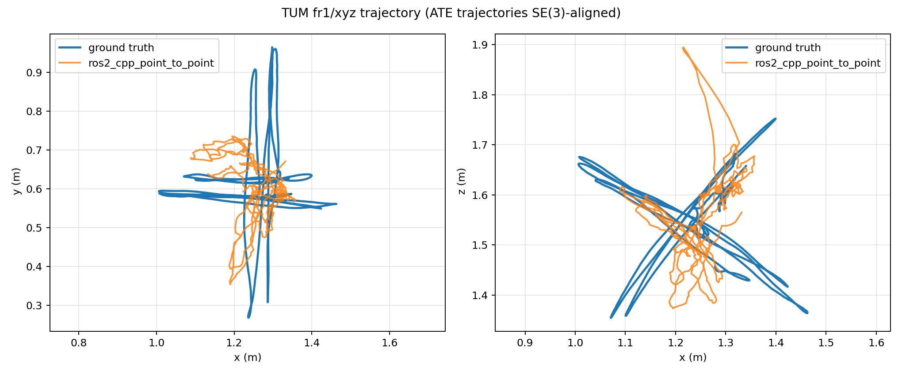

# ROS2 Jazzy C++ 全序列真实运行结果

这组证据来自公开仓库的 GitHub Actions 运行 [30074936189](https://github.com/yang07-29/rgbd-pointcloud-registration/actions/runs/30074936189)。工作流在 Ubuntu 24.04 + ROS2 Jazzy 容器中下载 TUM 官方 `freiburg1/xyz`，以 Release 模式编译 C++ 节点，通过真实 ROS2 topic graph 发布 RGB、depth 和 CameraInfo，并处理全部 796 个关联帧。

## 结果

| 指标 | 实测值 |
| --- | ---: |
| 输入 / 轨迹 / 指标行数 | 796 / 796 / 796 |
| 接受 / 拒绝的相邻帧对 | 786 / 9 |
| ATE RMSE，SE(3) 对齐、无尺度（m） | 0.175783 |
| ATE mean / median / max（m） | 0.157059 / 0.146168 / 0.390578 |
| RPE 平移 RMSE，Δ=1 帧（m） | 0.011151 |
| RPE 旋转 RMSE，Δ=1 帧（度） | 0.574568 |
| C++ ROS 回调 mean / median / p95（ms） | 3.074 / 2.413 / 7.161 |
| 按回调均值换算的计算吞吐（FPS） | 325.35 |
| 数据时间戳频率（Hz） | 29.92 |
| C++ 节点 RSS 峰值 | 82,722,816 B / 78.89 MiB |
| GPU / 模型大小 | 未使用 / N/A |

回调时间包含消息转换、深度反投影、体素下采样、point-to-point ICP、位姿累积、ROS 消息构造/发布以及 CSV/RSS 记录，但不包含发布器读取 PNG 的时间。**325.35 FPS 是纯回调计算吞吐，不是相机端到端帧率**；本次数据按原时间戳约 29.92 Hz 回放。

## 完整性与真实性边界

- 里程计节点只订阅 `/camera/color/image_raw`、`/camera/depth/image_raw` 和 `/camera/camera_info`；真值不发布，也不进入估计过程。
- 真值只由节点退出后的离线脚本读取，用于统一的 ATE/RPE 评测。
- ROS2 `ApproximateTime` 会暂存最后一对消息。发布器在 796 个真实帧之后发送一个更晚时间戳的同步刷新对，只用于释放第 796 个真实帧；刷新对不进入轨迹或指标。因此最终节点日志是收到 797/797，证据仍严格只有原始 796 个时间戳。
- 9 个帧对因残差 RMSE 高于 correspondence 阈值而被明确拒绝；拒绝后保持上一位姿，失败没有被隐藏。
- 这是 GitHub 托管 runner 的 CPU 结果，不代表本地 Windows、Jetson、真实相机或机器人性能。

## 证据索引

- [`run_summary.json`](run_summary.json)：帧数、状态计数、性能与 ATE/RPE 汇总。
- [`performance.json`](performance.json)：回调延迟、消息计数、RSS 与输入频率。
- [`metrics.csv`](metrics.csv)：796 帧逐帧延迟、点数、RMSE、状态与 RSS。
- [`trajectory_local.txt`](trajectory_local.txt)：C++ ROS2 节点直接写出的 796 位姿未对齐 TUM 轨迹。
- [`trajectory_ate_aligned.txt`](trajectory_ate_aligned.txt)：仅用于展示的 SE(3) 对齐轨迹。
- [`evaluation.json`](evaluation.json)：统一评测程序的精确输出。
- [`odometry_node.log`](odometry_node.log)、[`publisher.log`](publisher.log)：节点与发布器原始日志。
- [`topic_list.txt`](topic_list.txt)、[`odom_once.yaml`](odom_once.yaml)：ROS graph 和独立 `/odom` 接收证据。
- [`runner_environment.txt`](runner_environment.txt)、[`dataset_archive_sha256.txt`](dataset_archive_sha256.txt)：平台/依赖与官方压缩包哈希。

## 复现

在 GitHub 仓库的 **Actions → ROS2 C++ full TUM sequence → Run workflow** 手动触发；工作流定义见 [`.github/workflows/ros2-cpp-full-sequence.yml`](../../.github/workflows/ros2-cpp-full-sequence.yml)，实际运行入口见 [`scripts/run_ros2_cpp_full_sequence.sh`](../../scripts/run_ros2_cpp_full_sequence.sh)。工作流会下载官方数据、Release 编译、运行、逐项校验 796 行并上传 evidence artifact；任一步不满足会失败。
